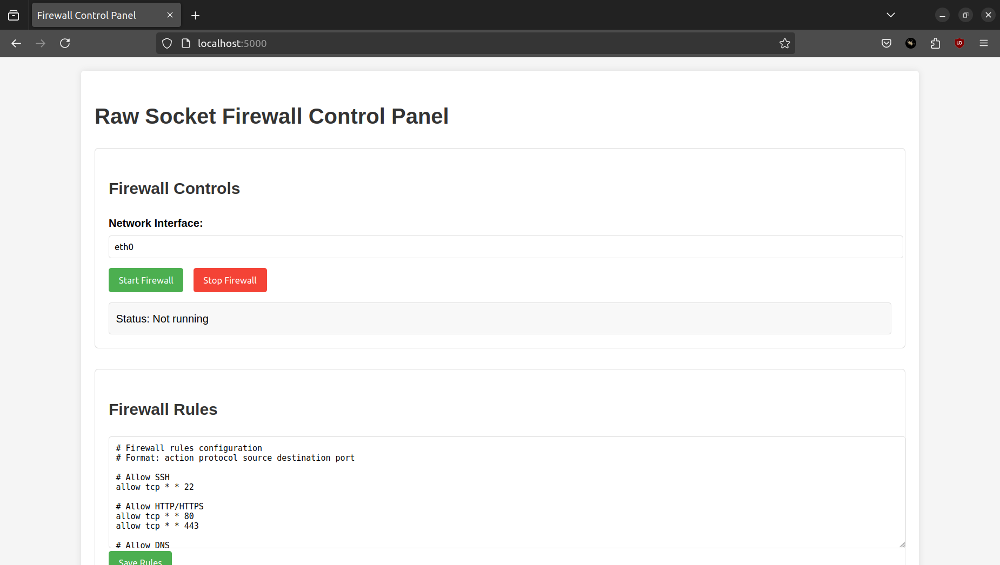

# Raw Socket Firewall with Packet Inspection

[](https://github.com/deepakbalusupati/Raw-Socket-Firewall-with-Packet-Inspection.git)
[](https://github.com/deepakbalusupati/Raw-Socket-Firewall-with-Packet-Inspection.git)
[](https://github.com/deepakbalusupati/Raw-Socket-Firewall-with-Packet-Inspection.git)
[](https://github.com/deepakbalusupati/Raw-Socket-Firewall-with-Packet-Inspection.git)

A cross-platform network firewall that operates at the raw socket level, providing packet filtering and basic deep packet inspection capabilities. Features a web-based control panel for real-time monitoring and rule management.

## Features

- **Layer 3/4 Packet Filtering** - Filter TCP, UDP, and ICMP traffic
- **Web-Based Control Panel** - Flask-based interface for monitoring and configuration
- **Custom Rule Engine** - Define allow/deny rules based on protocol, source, destination, and port
- **Cross-Platform Compatibility** - Works on both Linux and Windows systems
- **Deep Packet Inspection** - Basic DPI for HTTP payload analysis to detect attack patterns

## Prerequisites

### Linux

```bash
sudo apt update && sudo apt install -y \
    build-essential \
    cmake \
    libpcap-dev \
    python3 \
    python3-pip \
    python3-netifaces
```

### Windows

- Install [Visual Studio](https://visualstudio.microsoft.com/) with C++ development tools
- Install [CMake](https://cmake.org/download/)
- Install [Npcap SDK](https://nmap.org/npcap/dist/npcap-sdk-1.12.zip) for packet capture
- Install [Python 3.6+](https://www.python.org/downloads/)
- Install Python dependencies:
  ```bash
  pip install flask psutil
  ```

## Installation

### Linux

```bash
# Clone the repository
git clone https://github.com/deepakbalusupati/Raw-Socket-Firewall-with-Packet-Inspection.git
cd raw-socket-firewall

# Build the firewall
mkdir build && cd build
cmake ..
make

# Run the firewall (requires root privileges)
sudo ./firewall
```

### Windows

```bash
# Clone the repository
git clone https://github.com/deepakbalusupati/Raw-Socket-Firewall-with-Packet-Inspection.git
cd raw-socket-firewall

# Build the firewall
mkdir build && cd build
cmake ..
cmake --build . --config Release

# Run the firewall (requires Administrator privileges)
.\Release\firewall.exe
```

## Configuration

### Firewall Rules

The firewall rules are stored in `config/firewall.rules`. Each rule has the following format:

```
action protocol source destination port
```

Where:

- **action**: `allow` or `deny`
- **protocol**: `tcp`, `udp`, or `*` (any)
- **source**: Source IP address or `*` (any)
- **destination**: Destination IP address or `*` (any)
- **port**: Port number or `0` (any)

Example rules:

```
allow tcp * * 80      # Allow HTTP
allow tcp * * 443     # Allow HTTPS
allow udp * * 53      # Allow DNS
deny udp * * 123      # Block NTP
deny * * * *          # Default deny all other traffic
```

### IP Blacklist and Whitelist

- **Blacklist**: Add IP addresses to block in `config/blacklist.txt`
- **Whitelist**: Add trusted IP addresses in `config/whitelist.txt`

Each file should contain one IP address per line.

## Usage

### Command Line

```bash
# Show help
firewall --help

# List available network interfaces
firewall --list-interfaces

# Start firewall with auto-detected interface
sudo firewall

# Start firewall with specific interface
sudo firewall eth0  # Linux
sudo firewall "Ethernet"  # Windows
```

### Web Interface

The web interface provides a user-friendly way to control the firewall:

1. Start the web server:

   ```bash
   cd web
   python app.py
   ```

2. Access the interface at: http://localhost:5000

From the web interface, you can:

- Start/stop the firewall
- Select the network interface
- View and edit firewall rules
- Monitor blocked connections in real-time

## Project Structure

```
raw-socket-firewall/
├── build/                # Compiled binaries
├── config/               # Configuration files
│   ├── firewall.rules    # Main rule definitions
│   ├── blacklist.txt     # Blocked IP addresses
│   └── whitelist.txt     # Trusted IP addresses
├── src/                  # Source code
│   ├── include/          # Header files
│   │   ├── firewall.h    # Firewall class definition
│   │   └── platform.h    # Platform-specific code
│   ├── impl/             # Implementation files
│   │   ├── firewall.cpp  # Firewall implementation
│   │   └── packet_inspector.cpp # DPI implementation
│   └── main.cpp          # Entry point
├── web/                  # Web interface
│   ├── app.py            # Flask application
│   ├── static/           # CSS and JavaScript
│   └── templates/        # HTML templates
└── CMakeLists.txt        # CMake build configuration
```

## Limitations

- The firewall operates in passive mode (monitoring only) and does not actively block packets
- Requires administrator/root privileges to access raw sockets
- Deep packet inspection is limited to basic pattern matching
- Windows implementation requires Npcap or WinPcap installed

## Troubleshooting

### Common Issues

#### Permission Denied

- Linux: Make sure you're running with `sudo` privileges
- Windows: Run as Administrator

#### Interface Not Found

- Use `firewall --list-interfaces` to see available interfaces
- Verify the interface name is correct (case-sensitive on Windows)

#### Build Failures on Windows

- Ensure Npcap SDK is properly installed
- Check that the SDK path is correctly specified in CMakeLists.txt
